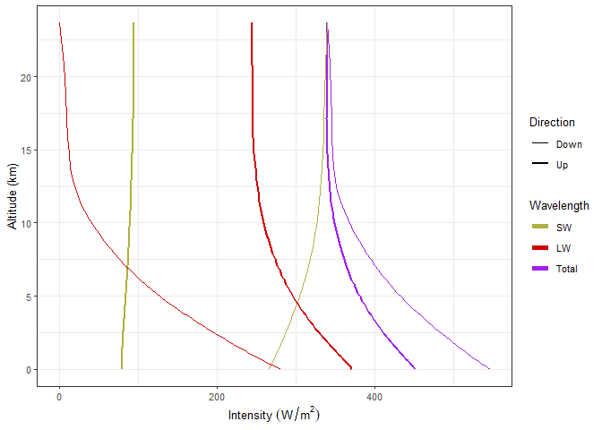

Instructions for Lab \#4
================
Jonathan Gilligan
Lab: Mon. Feb. 15 Due: Mon. Feb. 24.

-   [Exercises with lapse rate and
    clouds.](#exercises-with-lapse-rate-and-clouds.)
    -   [R Interface to RRTM](#r-interface-to-rrtm)
    -   [Example of running RRTM](#example-of-running-rrtm)
        -   [Interpreting RRTM Results](#interpreting-rrtm-results)
        -   [Determining Climate Sensitivity with
            RRTM](#determining-climate-sensitivity-with-rrtm)
-   [New R and RMarkdown tricks](#new-r-and-rmarkdown-tricks)
-   [Exercises](#exercises)
    -   [General Instructions](#general-instructions)
        -   [Exercise 1: Lapse Rate](#exercise-1-lapse-rate)
    -   [Exercises on Albedo and
        Clouds](#exercises-on-albedo-and-clouds)
        -   [Exercise 2: The urban heat
            island](#exercise-2-the-urban-heat-island)
        -   [Exercise 3: Clouds](#exercise-3-clouds)

# Exercises with lapse rate and clouds.

In this lab, you will learn about a new climate model, RRTM. RRTM stands
for “Rapid Radiative Transfer Model.” This model is a
radiative-convective model that uses code from the radiative-transfer
portion of a state-of-the-art global climate model called the “Community
Climate System Model,” developed at the National Center for Atmospheric
Research in Boulder CO.

The entire CCSM model runs on giant supercomputers, but this radiative
transfer module can run efficiently on an ordinary computer. In order to
speed up the calculations, RRTM does not calculate the entire longwave
spectrum the way MODTRAN does, but uses a simplified approximation that
is much faster when the big climate models need to run this radiative
transfer calculation roughly 52 quadrillion (5.2×10<sup>15</sup>) times
in a simulation of 100 years of the earth’s climate.

An advantage that RRTM has over MODTRAN, is that MODTRAN assumes that
the atmosphere is static (none of the air moves), whereas RRTM allows
for convective heat flow. This makes RRTM more realistic, even though it
sacrifices detail in its treatment of longwave radiation.

We will use RRTM to explore the role of convection in the earth system
and to examine the water-vapor feedback in the presence of convection.

You can run the RRTM model interactively on the web at
<http://climatemodels.uchicago.edu/rrtm/> and I have also written a
script that allows you to run it from R.

To run the model interactively, you can adjust various parameters, such
as the brightness of the sun, the albedo (it gives you a choice of many
natural and human-made surfaces, such as asphalt, concrete, forest,
grassland, snow, ocean, and the average for the earth) the
concentrations of CO<sub>2</sub> and methane, the relative humidity, and
the amount and type of high (cirrus) and low (stratus) clouds.

You can also introduce aerosols typical of different parts of the earth,
such as cities (with soot, sulfates, and other pollution), deserts (with
blowing dust), oceans (with sea spray and salt), and a Pinatubo-like
volcanic eruption.

Like MODTRAN, the RRTM model does not automatically adjust the surface
temperature. Instead, it calculates the upward and downward flux of
longwave and shortwave radiation at 51 different levels of the
atmosphere and reports whether the heat flow is balanced (heat in = heat
out) at the top of the atmosphere.

If the earth is *gaining* heat, you can manually *raise* the surface
temperature until you balance the heat flow, and if the earth is
*losing* heat, you can manually *lower* the temperature.

## R Interface to RRTM

I have written an R function `run_rrtm` that allows you to manually run
RRTM from R. To use this function, you need to include the line
`source("_scripts/rrtm.R")` or `source(file.path(script_dir, "rrtm.R"))`
to load it.

-   `run_rrtm()` allows you to automatically download a file with the
    data from a MODTRAN run. You call it with the following arguments:

    -   `filename` is the name of the file to save the data to. The
        function returns the output data, so it’s optional to specify a
        file name.

    -   `co2_ppm` is the amount of CO<sub>2</sub> in parts per million.
        The default is 400.

    -   `ch4_ppm` is the amount of methane in parts per million. The
        default is 1.7.

    -   `relative_humidity` is the relative humidity, in percent. The
        default is 80%.

    -   `T_surface` is the surface temperature, in Kelvin. The default
        (for 400 ppm CO<sub>2</sub>, etc.) is 284.42. You adjust this to
        restore radiative equilibrium after you change the parameters
        (amount of CO<sub>2</sub>, lapse rate, etc.).

    -   `I_solar` is the brightness of the sun, in Watts per square
        meter. The default value is 1360.

    -   `surface_type` is the type of surface (this is used to calculate
        the albedo). The default is \`earth average. The options are:

        -   “`earth average`”: The average albedo of the earth (0.30)
        -   “`asphalt`”: Dark asphalt (0.08)
        -   “`concrete`”: Concrete (0.55)
        -   “`desert`”: Typical desert (0.40)
        -   “`forest`”: Typical forest (0.15)
        -   “`grass`”: Typical grassland (0.25)
        -   “`ocean`”: Ocean (0.10)
        -   “`snow`”: Typical snow (0.85)
        -   “`ice`”: Large ice masses covering ocean or land (0.60)
        -   “`soil`”: Bare soil (0.17)
        -   “`custom`”: Custom albedo (if you choose this, you need to
            also supply a value for `albedo`)

    -   `tropopause_km` is the altitude of the tropopause, in kilometers
        above sea level. The default value is 15, which is typical of
        middle latitudes. The tropopause varies from place to place
        around the Earth, from around 9 km at the poles to around 17 km
        near the equator.

    -   `lapse_rate` is the lapse rate, in Kelvin per kilometer. The
        default is 6, which is roughly the global average environmental
        lapse rate. The dry adiabatic lapse rate is 10, so it’s
        physically impossible to have an persistent environmental lapse
        rate greater than 10 and results with `lapse_rate` greater than
        10 won’t make sense.

    -   `low_cloud_frac` is the fraction (from 0.0–1.0) of the sky
        covered by low (stratus) clouds. The default is 0.0.

    -   `high_cloud_frac` is the fraction (from 0.0–1.0) of the sky
        covered by high (cirrus) clouds. The default is 0.0.

    -   `cloud_drop_radius` is the size of the water droplets in the
        clouds, in microns. The default is 10. (For reference, 10
        microns is about the size of a red blood cell). You can make the
        droplets smaller to simulate the indirect aerosol effect.

    -   `aerosols` allows you to set up the atmosphere with the kinds
        and quantities of aerosols typical of a number of different
        environments. Options are:

        -   “`none`”: No aerosols
        -   “`ocean`”: Typical ocean aerosols (sea-spray, salt, etc.)
        -   “`desert`”: Typical desert aerosols (dust, sand)
        -   “`city`”: Typical city with soot (black carbon) and sulfate
            aerosols.
        -   “`city just sulfates`”: Just sulfate aerosols typical of a
            city.
        -   “`city just soot`”: Just soot (black carbon) aerosols
            typical of a city.
        -   “`land`”: Typical rural land (dust, etc.)
        -   “`polluted land`”: Typical rural land suffering from
            pollution (e.g., from farming)
        -   “`antarctic`”: Typical aerosols for Antarctica
        -   “`volcano`”: Similar sulfate and dust to the Mt. Pinatubo
            volcanic eruption.

    Any arguments you don’t specify explicitly take on their default
    value. Thus,
    `run_rrtm(co2_ppm = 800, relative humidity = 10, T_surface = 300)`
    would run with all the default values, except for 800 ppm
    CO<sub>2</sub>, relative humidity of 10%, and a surface temperature
    of 300 Kelvin.

    `run_rrtm` returns a list of data containing:

    -   Basic parameters of the model run:
        -   `T_surface`
        -   `co2_ppm`
        -   `ch4_ppm`
        -   `I_solar`
        -   `albedo`
        -   `lapse_rate`
        -   `tropopause_km`
        -   `relative_humidity`
        -   `aerosols`,
        -   `low_cloud_frac`
        -   `high_cloud_frac`
        -   `cloud_drop_radius`
    -   Results of the model calculations:
        -   `Q`: The heat imbalance *I*<sub>in</sub> − *I*<sub>out</sub>
        -   `i_in`: The net solar radiation absorbed by the earth
            ((1 − *α*)*I*<sub>solar</sub>/4)
        -   `i_out`: The net longwave radiation emitted to space from
            the top of the atmosphere
        -   `profile`: A tibble containing a profile of the atmosphere
            (altitude in km, pressure in millibar, and temperature in
            Kelvin)
        -   `fluxes`: A tibble containing the fluxes (in Watts per
            square meter) of longwave, shortwave, and total radiation
            going up and down at 52 levels from the surface to the top
            of the atmosphere. The columns are `altitude` (km), `T`
            (temperature in K), `P` (pressure in millibar), `sw_up`
            (upward shortwave), `sw_down` (downward shortwave), `lw_up`
            (upward longwave), `lw_down` (downward longwave), `total_up`
            (`sw_up` + `lw_up`), and
            `total_down (`sw\_down`+`lw\_down\`).

There are also functions for reading RRTM data files and plotting RRTM
data:

-   `read_rrtm(file)` reads an RRTM file saved by `run_rrtm` and returns
    a list of data just like the one returned by `run_rrtm`.

-   `plot_heat_flows()`: plots the upward and downward fluxes of
    radiation from an RRTM file or data structure. You can call it
    either with `plot_rrtm(file = "filename")` or
    `plot_rrtm(data = rrtm_data)`, where “`filename`” and “`rrtm_data`”
    stand for your own file name or RRTM data structure returned by
    `run_rrtm` or `read_rrtm`.

    You can also specify which wavelengths to plot. By default, it plots
    shortwave (SW), longwave (LW), and total (SW + LW), but you can
    specify one or more of `sw = FALSE`, `lw = FALSE`, or
    `total = FALSE` to omit wavelengths.

## Example of running RRTM

Here is an example of running RRTM:

``` r
default_rrtm = run_rrtm()

# Surface temperature:
default_rrtm$T_surface
```

    ## [1] 284.42

``` r
# Heat imbalance:
default_rrtm$Q
```

    ## [1] 0

This run has surface temperature 284. K and a heat imbalance of 0 Watts
per square meter.

### Interpreting RRTM Results

We can plot the heat flows as a function of altitude:

``` r
plot_heat_flows(default_rrtm)
```

<!-- -->

What you see in this plot are thick lines representing downward heat
flow and thin lines representing upward flow. The different colors
represent shortwave, longwave, and total (shortwave + longwave).

A few things to notice: At the top of the atmosphere, at 20. km, there
is very little longwave going down, but a lot of shortwave going down
(around 340. W/m<sup>2</sup>). Conversely, there is a modest amount of
shortwave going up (around 100. W/m<sup>2</sup>), but a lot of longwave
going up (around 240. W/m<sup>2</sup>).

The upward shortwave radiation is sunlight reflected from the atmosphere
and the earth’s surface.

The upward longwave radiation is emitted from the surface and the
atmosphere. You can see that the longwave radiation, both up and down,
is greater closer to the surface, where temperatures are warmer, and
smaller at higher altitudes, where the atmosphere is cooler.

If we look at the total radiation, we see that there is a good balance
near the top of the atmosphere (the upward and downward lines come
together), but in the lower atmosphere, there is a serious imbalance
with downward fluxes significantly larger than the upward ones.

This is a consequence of convection: The difference between the downward
and upward radiative fluxes is taken up by convection, which moves heat
upward when warm air rises and cool air sinks.

### Determining Climate Sensitivity with RRTM

We can also use the RRTM model to study what happens when we double
CO<sub>2</sub>:

``` r
rrtm_double_co2 = run_rrtm(co2_ppm = 800)
```

When we double CO<sub>2</sub> without changing the surface temperature
(T<sub>surface</sub> = 284.4 K), this creates a heat imbalance of 4.2
W/m<sup>2</sup>. We can use the online interactive version of RRTM to
adjust surface temperature until the heat flows balance. The surface
temperature where this happens is 286.9 K and we can paste it into our R
code:

``` r
new_ts = 286.9 # Kelvin
rrtm_double_co2_balanced = run_rrtm(co2_ppm = 800, T_surface = new_ts)
```

When we set T<sub>surface</sub> to 286.9 K, the heat imbalance becomes 0
Watts/m<sup>2</sup>. The climate sensitivity is the change in
equilibrium T<sub>surface</sub> when you double CO<sub>2</sub>:
*Δ**T*<sub>2 × CO<sub>2</sub></sub> = 286.9 *K* − 284.4 *K* = 2.5 *K*.
You may remember that in last week’s lab, we calculated the climate
sensitivity with MODTRAN (using constant relative humidity to enable
water-vapor feedback) and got *Δ**T*<sub>2 × CO<sub>2</sub></sub> = 1.2
K for the tropical atmosphere (it’s smaller for the other atmospheres),
so this shows that including convection in our calculations roughly
doubles the climate sensitivity.

# New R and RMarkdown tricks

Sometimes you may want to use different text into your document,
depending on what the result of a calculation is.

For instance, I might have a function called `foo` that returns a number
and I want to write something different if `foo(x)` &gt; x than if
`foo(x)` &lt; x. Here, the function `ifelse` can come in handy.

``` r
foo = function(x) {
  x^2
}
```

Now I can write `ifelse(foo(x) < x, "less than", "greater than")`. The
following RMarkdown text:

    When x = 0.5, `foo(x)` is
    `r x = 0.5; ifelse(foo(x) < x, "less than", "greater than")` x,
    but when x = 2.0, `foo(x)` is
    `r x = 2.0; ifelse(foo(x) < x, "less than", "greater than")` x.

becomes

> When x = 0.5, `foo(x)` is less than x, but when x = 2.0, `foo(x)` is
> greater than x.

You may have spotted a problem with the code above: What if `foo(x)` =
x? Then I need another `ifelse`:
`ifelse(foo(x) < x, "less than", ifelse(foo(x) > x, "greater than", "equal to"))`.
This is cumbersome to type into your text, so you might want to write a
function:

``` r
compare_f = function(f, x) {
  # f is a function
  # x is a number or a numeric variable
  result = f(x)
  ifelse(result < x, "less than",
         ifelse(result > x, "greater than",
                "equal to"))
}
```

Now I can just write `compare_f(foo, x)`: The following RMarkdown text:

``` r
When x = 0.5, `foo(x)` is `r compare_f(foo, 0.5)` x, but
when x = 2.0, `foo(x)` is `r compare_f(foo, 2.0)` x, and
when x = 1.0, `foo(x)` is `r compare_f(foo, 1.0)` x.
```

becomes

> When x = 0.5, `foo(x)` is less than x, but when x = 2.0, `foo(x)` is
> greater than x, and when x = 1.0, `foo(x)` is equal to x.

This may seem kind of strange, but a lot of people and organizations use
RMarkdown to prepare reports regularly using different data. For
instance, many businesses use RMarkdown to generate monthly reports on
sales, finances, etc., and using code like the `compare` function I
showed here can help to automate the reports, so that when they run the
report each month using different data, the text will adjust
automatically to reflect the new numbers.

It is also applicable to climate science, where many laboratories like
to update their reports every month or every year with the latest
climate data.

# Exercises

These are the exercises you will work for the lab this week.

## General Instructions

In the past three weeks, we focused on mastering many of the basics of
using R and RMarkdown. For this week’s lab, when you write up the
answers, I would like you to think about integrating your R code chunks
with your text.

For instance, you can describe what you’re going to do to answer the
question, and then for each step, after you describe what you’re going
to do in that step, you can include an R code chunk to do what you just
described, and then the subsequent text can either discuss the results
of what you just did or describe what the next step of the analysis will
do.

This way, your answer can have several small chunks of R code that build
on each other and follow the flow of your text.

For this lab, you will use the RRTM model, which includes both radiation
and convection.

### Exercise 1: Lapse Rate

Run the RRTM model in its default configuration and then vary the lapse
rate from 0 to 10 K/km. For each value of the lapse rate, adjust the
surface temperature until the earth loses as much heat as it gains
(i.e., the value of *Q* in the `run_rrtm` model output is zero.)

It will probably be easier to do this with the interactive version of
the RRTM model at <http://climatemodels.uchicago.edu/rrtm/> than with
the R interface `run_rrtm`.

1.  Make a tibble containing the values of the lapse rate and the
    corresponding equilibrium surface temperature, and make a plot with
    lapse rate on the horizontal axis and surface temperature on the
    vertical axis.

2.  Describe how the equilibrium surface temperature varies as the lapse
    rate varies.

## Exercises on Albedo and Clouds

For the following exercises, start off with the RRTM model in its
default configuration. Record the ground temperature. For each part of
this exercise you will do the following:

1.  You will adjust the albedo or the clouds.

2.  You will compare the visible and longwave radiation going down
    through the atmosphere to the surface and also the visible and
    longwave radiation going up from the surface, through the
    atmosphere, to space.

    The results of an RRTM model run have a tibble called `fluxes` with
    columns for `altitude`, `sw_down`, `sw_up`, `lw_down`, `lw_up`,
    `total_down`, and `total_up`, where `sw` means shortwave, `lw` means
    longwave, and `total` is the sum of shortwave plus longwave.

    The first row of this tibble is at ground-level and the last row is
    at the top of the atmosphere.

    ``` r
    default_data = run_rrtm()
    fluxes = default_data$fluxes
    surface_fluxes = head(fluxes, 1) # get the first row
    space_fluxes = tail(fluxes, 1)   # get the last row
    ```

3.  You will adjust the ground temperature until the heat coming in
    balances the heat going out (the model will say, “If the Earth has
    these properties … then it loses as much energy as it gains.”

### Exercise 2: The urban heat island

First, run the RRTM model in its default configuration and note the
surface temperature and the albedo.

``` r
default = run_rrtm()
albedo_default = default$albedo
T_surface_default = default$T_surface
```

1.  Change the surface albedo from “Earth’s average” to “Asphalt”. the
    changes in the local climate:

    -   What is the albedo?
    -   Report the changes in shortwave and longwave light absorbed by
        the surface and going out to space.
    -   How much does the total balance of heat change (i.e., how many
        W/m<sup>2</sup> does the Earth lose or gain)?
    -   Adjust the ground temperature until the Earth loses as much
        energy as it gains.
    -   What is the new surface temperature? How does it compare to the
        surface temperature in the default configuration?

2.  Change the surface albedo to “Concrete”. Answer the same questions
    as in part (a).

3.  In cities, streets and parking lots are usually paved with asphalt.
    Roofs of houses and other buildings are often covered with asphalt
    shingles or black rubber-like compounds.

    How would the choice of using asphalt for roads, parking lots, and
    roofs in a large city affect the local climate in the city? Would
    using low-albedo materials, such as concrete for streets and parking
    lots and light-colored polymers for the roofs of buildings have a
    benefit for the people living in the city?

### Exercise 3: Clouds

First, run the RRTM model in its default configuration and note the
surface temperature and the albedo.

1.  Change the low cloud fraction to 0.70 (70%)

    -   Report the changes in shortwave and longwave light absorbed by
        the surface and going out to space.
    -   How much does the total balance of heat change (i.e., how many
        W/m<sup>2</sup> does the Earth lose or gain)?
    -   Adjust the temperature to bring the heat flows back into
        balance.
    -   How much did the temperature change?

2.  Repeat part (a), but with the low cloud fraction set to 0 and the
    high-cloud fraction set to 0.20 (20%).

3.  Use the `plot_heat_flows()` function to plot the heat flows for the
    low clouds and the high clouds. Describe the changes you see in the
    upward and downward heat flows (shortwave, longwave, and total) for
    the two cases. Which kind of cloud had the biggest effect on the
    outgoing radiation?
